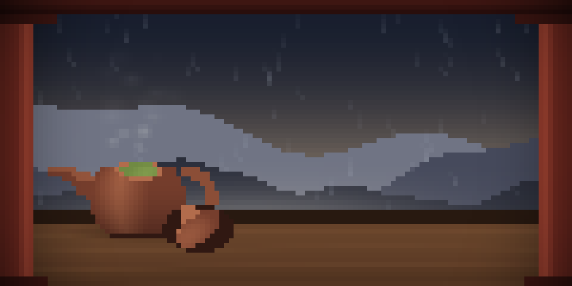

<p align="center">
  
</p>

<h3 align="center">闲笔</h3>

<p align="center"><em>闲笔不闲</em></p>

<p align="center">
  Your agent is running, and there is a poem on the screen.
</p>

<p align="center">
  
</p>

---

`poemtea` wraps a coding agent's CLI. When the agent has been working for a
while, the terminal turns into a slow procedural picture with a Tang quatrain
under it:

```
远上寒山石径斜，白云生处有人家。
停车坐爱枫林晚，霜叶红于二月花。

              — 杜牧
```

When the agent answers — or the moment you touch the keyboard — it comes apart
and your screen is exactly as you left it.

Nothing is ever written to the screen underneath, so it cannot be damaged. Your
keystrokes reach the agent untouched and immediately, picture or no picture.

## Requirements

- Go 1.24 or later
- A terminal with 24-bit colour (see [Troubleshooting](#troubleshooting) if you
  use tmux)
- An agent whose lifecycle you can hook. Claude Code works out of the box; see
  [Other agents](#other-agents).

## Install

```bash
go install github.com/jc-244/poemtea@latest
```

Or from a clone:

```bash
go build -o ~/.local/bin/poemtea .
```

Three dependencies, all small: `creack/pty`, `golang.org/x/term`, and
`mattn/go-runewidth`.

## Quick start

**1. Look at it, with no agent involved:**

```bash
poemtea demo        # n for the next poem, q to quit
```

**2. Wire up the hooks:**

```bash
poemtea install-hooks     # prints the config; it does not write anything
```

Merge the printed block into `~/.claude/settings.json`.

**3. Run your agent through it:**

```bash
poemtea run -- claude
```

That is all. Quit the agent as usual and `poemtea` exits with it.

## Usage

```
poemtea run -- <command>   run an agent behind the picture
poemtea demo               play the scene full-screen
poemtea install-hooks      print the hook configuration
poemtea busy | idle        mark a session working or done (called by hooks)
```

### Options

| Flag | Default | |
|---|---|---|
| `-after` | `16` | seconds of agent work before the picture appears |
| `-linger` | `1.5` | seconds of quiet before it goes away |
| `-idle` | `30` | seconds of nothing at all before it appears anyway; `0` disables |

```bash
poemtea run -after 30 -idle 0 -- claude
```

### When the picture appears

```
you press enter
  │  UserPromptSubmit -> busy
  ▼
  ├─ 0s ────────── 16s ────────────────────────────┐
  │              └─ still busy: picture assembles  │
  ▼                                                ▼
Stop -> idle ──> quiet for 1.5s ──> it comes apart
```

The trigger is the whole turn, not "thinking" specifically. The
think/tool/think oscillation inside a turn is deliberately invisible, so one
turn is at most one interruption. What `-after` decides is which turns are long
enough to be worth covering the screen for.

There is a second way in: nothing has moved at all for `-idle` seconds — no key
pressed and nothing drawn by the agent either. Requiring both to be still means
it can never cover an answer while it is still being written, only one you have
already stopped reading.

### When it goes away

**Anything deliberate** — a key, a click, the wheel turned up or down. Not the
mouse drifting across the window, not a drag, not the wheel going sideways, and
not you switching to another application.

This is also the escape hatch: if the busy flag ever sticks, one keystroke gets
your terminal back.

### How the hooks decide

The whole rule is: **the agent working on its own is busy; the agent waiting on
you is not.**

| Event | Marks | Why |
|---|---|---|
| `UserPromptSubmit` | busy | you handed the work over |
| `PostToolUse` | busy | it is (back) working on its own |
| `PermissionRequest` | **idle** | it is waiting on *you* — give the screen back at once |
| `Notification` | **idle** | likewise, anything wanting your attention |
| `Stop` | idle | the turn is over |
| `SessionEnd` | idle | the session is over |

## Other agents

Nothing here is specific to Claude Code. `~/.poemtea/sessions/` is a protocol,
not an integration: one small JSON file per session, `{owner, busy, updated}`,
written atomically. Anything that can run a command when it starts and stops
working can join in with a three-line hook, and the renderer does not change.

## The poems

杜牧 (803–852), every 绝句 in 全唐詩 卷520–527 — 206 of them, public domain.
Nobody selected them; the definition is arithmetic. `internal/poem/corpus.go`
is generated, and `corpus.py` beside it rebuilds it from the source. Add a poem
by teaching the generator to find it, not by typing it in.

## Troubleshooting

```bash
POEMTEA_DEBUG=/tmp/poemtea.log poemtea run -- claude
```

A healthy run logs four lines: `start`, `layer up`, `layer leaving: <why>`,
`unmute`. It logs to a file and never to the screen, because a warning printed
into the middle of someone's terminal is worse than the bug it reports.

If a terminal is ever left in a strange state, `reset` fixes it.

**Colour drains out, or frames arrive in pieces, under tmux.** Both are one
misconfigured tmux, not a bug here. tmux decides what the terminal outside it
can do from that terminal's terminfo entry, and `xterm-256color` claims neither
24-bit colour nor synchronized output.

```bash
# ~/.tmux.conf — name whatever TERM the outer terminal actually reports
set -ag terminal-features ",xterm-256color:RGB:sync"
```

That line is read when a client attaches and never again, so **reattach and
check before concluding anything** — testing in a client that was already
attached will tell you the fix did not work:

```bash
tmux display -p '#{client_termfeatures}'   # RGB and sync must both appear
```

## Limitations

- **Truecolor is assumed.** A terminal that speaks only 256 colours snaps every
  value to its nearest palette entry and the gradients band.
- **Bandwidth.** Roughly 0.35 MB/s at 120×35 and 0.75 MB/s at 200×50. Fine
  locally, poor over SSH.
- **It does not know whether you are at the keyboard.** A turn longer than
  `-after` takes the screen whether you were staring at it or had walked away.
- **One scene runs** — a tea pavilion. Rain is still in the tree and still
  built; which one appears is one call.
- **English and Chinese only.** Scripts needing combining marks or joined forms
  are untested.
- **Quitting the agent leaves its last frame on screen** rather than the shell
  view you had before, because we hold the alternate buffer it would otherwise
  have used.

## How it works

`poemtea` runs the agent inside a pty and takes the terminal's alternate screen
buffer for itself. Showing and hiding the picture is two escape sequences; what
the agent drew while it was covered is replayed verbatim rather than
reconstructed.

The reasoning behind that, and the bugs that produced it, are in
[docs/design.md](docs/design.md).

## License

MIT — see [LICENSE](LICENSE).
